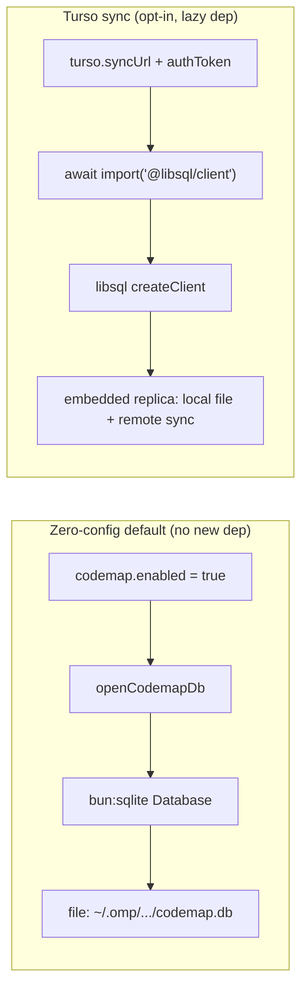

# Design: Task-Relevant Code Summaries (codemap-inspired) for oh-my-pi

> **Status**: Design complete, ready for implementation.
> **Branch**: `taskrelevant_context` in `oh-my-pi-dev`
> **Scope**: Minimal — agent-written file summaries + budget-packed task-relevant retrieval, native to oh-my-pi (not MCP), with automatic Turso setup.

---

## What this is

A native oh-my-pi feature that lets the agent **write short summaries about code files it has read**, persist them in libSQL/Turso, and **retrieve only the summaries relevant to the current task** on future turns — avoiding re-reading entire file trees. Token-efficient by construction: summaries are hard-capped at 1000 chars, retrieval is FTS-targeted, and a greedy budget packer bounds the response to a token ceiling.

Inspired by [devalade/codemap](https://github.com/devalade/codemap)'s agent-written summaries + task-context retrieval, but built natively into oh-my-pi's tool/settings/prompt system — **not** as an MCP server.

## What this is NOT

- **Not a memory backend.** This is a distinct axis: code-entity summaries keyed by file path with staleness tracking. It does NOT go into the `memory.backend` enum (`off`/`local`/`mnemopi`/`hindsight`). It composes with any memory backend — including `off` (the default).
- **Not the full codemap.** No call graph (`call_edges`), no references table, no imports/exports tracking, no indexing daemon, no semantic embeddings search. Those are future work.
- **Not multi-language.** TypeScript file extraction only in v1. A pluggable `LanguageAdapter` interface is declared for future Go/Python/Rust adapters but only `TsAdapter` ships.

---

## Architecture Decisions (verified through adversarial review)

### Decision 1: File-primary, single summaries table (Approach A)

**Choice**: One `summaries` table keyed by `(project_label, file_path)` composite primary key. No symbols table.

**Rationale**: Three architecture approaches were designed and adversarially reviewed by 5 independent skeptic judges. Approaches B (symbol-centric faithful port) and C (hybrid progressive) were both disqualified for violating the minimal-scope constraint:

| Approach | Symbols table? | Verdict |
|----------|--------------|---------|
| A — file-centric | No (single `summaries` table) | ✅ In scope |
| B — symbol-centric | Yes (`CREATE TABLE symbols`) | ❌ Constraint violation |
| C — hybrid | Yes (`file_summaries` + `symbol_summaries`) | ❌ Constraint violation |

Only Approach A respects the "summaries table + TS adapter + budget packer ONLY" constraint. The `summaries` table includes optional `symbol_name`/`symbol_kind`/`symbol_line_range` columns for disambiguation when a TS adapter is available, but there is no second base table.

### Decision 2: Dual-driver storage (bun:sqlite default + lazy libsql for Turso)

**Choice**: `bun:sqlite` for the zero-config local default; `@libsql/client` lazy-loaded only when Turso sync is configured.

**Rationale**: `bun:sqlite` is the codebase standard (11 files: memories, mnemopi, session, autoresearch, tools). FTS5 is proven working in `bun:sqlite` (history-storage.ts:103, mnemopi/schema.ts:130/137/361). No existing `@libsql/client` dependency exists. Adding a native NAPI binding to every install for a Turso feature most users won't enable violates AGENTS.md's "Use Bun APIs where they provide a cleaner alternative."

A thin `DbConnection` adapter interface abstracts both drivers so schema SQL is shared verbatim. The libsql driver lazy-loads via `await import('@libsql/client')` only on the Turso sync path (mirroring the `fastembed-runtime.ts:59-77` optional-peer pattern).



### Decision 3: Independent first-turn injection seam (NOT via memory backend)

**Blocker identified and fixed**: All three original designs proposed first-turn task-context injection via `backend.beforeAgentStartPrompt` (agent-session.ts:4945). But `#buildSystemPromptForAgentStart` early-returns when `memory.backend === "off"` (the default) because `offBackend` has no `beforeAgentStartPrompt` hook:

```typescript
// agent-session.ts:4945-4947 (EXISTING — the dead seam)
async #buildSystemPromptForAgentStart(promptText: string): Promise<string[]> {
    const backend = await resolveMemoryBackend(this.settings);
    if (!backend.beforeAgentStartPrompt) return this.#baseSystemPrompt;  // ← dead when memory.backend="off"
```

**Fix**: Add a new unconditional injection block that runs *before* the memory-backend block, gated only on `codemap.enabled`, with its own try/catch so a libSQL/FTS error can't break the memory backend path:

```typescript
async #buildSystemPromptForAgentStart(promptText: string): Promise<string[]> {
    // NEW: composable first-turn injection (runs regardless of memory.backend)
    const codemapBlock = await this.#injectCodemapTaskContext(promptText);
    const baseWithCodemap = codemapBlock
        ? [...this.#baseSystemPrompt, codemapBlock]
        : this.#baseSystemPrompt;

    const backend = await resolveMemoryBackend(this.settings);
    if (!backend.beforeAgentStartPrompt) return baseWithCodemap;
    // ... existing backend logic, but operate on baseWithCodemap as the "previousBase"
}
```

**Why codemap runs before the memory block**: (1) code summaries are stable background knowledge (like mnemopi's `STATIC_INSTRUCTIONS` framing), so ordering them first keeps the higher-recency memory block last; (2) it avoids coupling codemap's failure to the memory backend's try/catch.

**Once-per-session gating**: `#injectCodemapTaskContext` checks a `hasInjectedForFirstTurn` flag on the codemap session state (mirroring mnemopi/state.ts:313 `hasRecalledForFirstTurn`), so it fires once per fresh session, not every turn.

---

## Module Layout

New module at `packages/coding-agent/src/task-context/`:

| File | Responsibility |
|------|---------------|
| `index.ts` | Barrel re-exports + lazy factory `resolveCodemap(settings)` (mirrors `resolveMemoryBackend`) |
| `config.ts` | Settings → typed config loader (mirrors `mnemopi/config.ts:loadMnemopiConfig`) |
| `db.ts` | DB connection factory + schema bootstrap + FTS rebuild. `openCodemapDb(config)` returns a `DbConnection` (either `BunSqliteConnection` or `LibsqlConnection`) |
| `schema.ts` | Pure SQL DDL + migration runner. `initSchema(conn)` executes `CREATE TABLE IF NOT EXISTS` + FTS5 virtual table + sync triggers |
| `store.ts` | Data-access layer. CRUD over the single `summaries` table + FTS search queries |
| `staleness.ts` | Filesystem hash + staleness flag. `computeFileHash(path)` reads file from disk, returns `Bun.hash` hex string |
| `adapter.ts` | Pluggable `LanguageAdapter` interface + `TsAdapter` (the only v1 implementation) |
| `retrieve.ts` | The `get_task_context` retrieval pipeline (lexical extract → FTS seed → rank → budget packer) |
| `tools.ts` | Four native `AgentTool` classes with `createIf` gating |
| `prompt.ts` | System-prompt injection helpers. `buildCodemapPromptBlock(config, summaries)` |
| `turso.ts` | Turso connection resolution + auto-provisioning + `settings.set()` persist-back |
| `state.ts` | Per-session state via Symbol key on `AgentSession` (mirrors mnemopi state pattern) |

**Edits to existing files** (not new files):

| File | Change |
|------|--------|
| `config/settings-schema.ts` | Add `codemap.*` schema block after the hindsight config block |
| `modes/components/settings-defs.ts` | Add `codemapActive` condition (mirrors `mnemopiActive` at :93) |
| `tools/index.ts` | Register the 4 codemap tools as `createIf` factories |
| `sdk.ts` (~line 2149) | Append `codemapInstructions` to `appendParts[]` |
| `session/agent-session.ts` (~line 4945) | Add `#injectCodemapTaskContext` block before memory-backend block |
| `system-prompt.ts` (~line 419, ~671) | Add `codemapEnabled: boolean` to `BuildSystemPromptOptions`; thread `hasCodemap` into prompt data |
| `prompts/system/system-prompt.md` (~lines 55-57) | Add `{{#if hasCodemap}}` advertisement block |
| `hindsight/content.ts` | Extend `stripMemoryTags` regex to also strip `<codemap>...</codemap>` blocks |

---

## Database Schema

Single `summaries` table — file-keyed, with optional symbol disambiguation columns. No symbols table. Runs identically on `bun:sqlite` (local) and `@libsql/client` (Turso embedded replica).

```sql
-- ════════════════════════════════════════════════════════════════════════════
-- codemap schema v1: file-primary minimal.
-- ONE summaries table — file-keyed, with optional symbol disambiguation columns.
-- NO symbols/symbol_summaries second table (scope constraint).
-- Runs on BOTH local file: libSQL (zero-config default) and Turso-synced
-- embedded replica, unchanged.
-- ════════════════════════════════════════════════════════════════════════════

CREATE TABLE IF NOT EXISTS schema_migrations (
  version    INTEGER PRIMARY KEY,
  applied_at TEXT NOT NULL DEFAULT (datetime('now'))
);

-- PRIMARY store: one row per file the agent has summarized. Language-agnostic.
CREATE TABLE IF NOT EXISTS summaries (
  project_label  TEXT NOT NULL,          -- git primary root basename (isolates per-project)
  file_path      TEXT NOT NULL,           -- posix-relative to project root
  summary_text   TEXT NOT NULL,           -- hard-capped at 1000 chars on write
  content_hash   TEXT NOT NULL,           -- Bun.hash (xxHash64) of file contents at write time; '' if file missing
  symbol_name    TEXT,                    -- optional: symbol the summary is about (TS adapter)
  symbol_kind    TEXT,                    -- optional: 'function' | 'class' | 'method' | etc.
  symbol_line_range TEXT,                 -- optional: 'startLine-endLine' for symbol span
  source         TEXT NOT NULL DEFAULT 'agent',
  updated_at     TEXT NOT NULL DEFAULT (datetime('now')),
  PRIMARY KEY (project_label, file_path)
);

CREATE INDEX IF NOT EXISTS idx_summaries_project ON summaries(project_label);
CREATE INDEX IF NOT EXISTS idx_summaries_hash ON summaries(project_label, content_hash);

-- FTS5 over summary_text + file_path (external-content pattern, matching
-- history-storage.ts:103 and mnemopi/schema.ts:130).
CREATE VIRTUAL TABLE IF NOT EXISTS summaries_fts USING fts5(
  summary_text,
  file_path,
  content='summaries',
  content_rowid='rowid'
);

-- Sync triggers (identical pattern to history-storage.ts:105-108).
CREATE TRIGGER IF NOT EXISTS summaries_ai AFTER INSERT ON summaries BEGIN
  INSERT INTO summaries_fts(rowid, summary_text, file_path)
  VALUES (new.rowid, new.summary_text, new.file_path);
END;

CREATE TRIGGER IF NOT EXISTS summaries_ad AFTER DELETE ON summaries BEGIN
  INSERT INTO summaries_fts(summaries_fts, rowid, summary_text, file_path)
  VALUES('delete', old.rowid, old.summary_text, old.file_path);
END;

CREATE TRIGGER IF NOT EXISTS summaries_au AFTER UPDATE ON summaries BEGIN
  INSERT INTO summaries_fts(summaries_fts, rowid, summary_text, file_path)
  VALUES('delete', old.rowid, old.summary_text, old.file_path);
  INSERT INTO summaries_fts(rowid, summary_text, file_path)
  VALUES(new.rowid, new.summary_text, new.file_path);
END;
```

**Staleness**: `content_hash` is `Bun.hash(contents).toString(16)` of the file on disk at write time. On read, `computeFileHash(path)` recomputes and compares. If they differ → `stale: true`. If the file is missing → `content_hash = ''` and `stale: true` with a `missing` flag.

---

## Settings

Distinct `codemap.*` settings group (NOT in `memory.backend` enum). Follows the `SETTINGS_SCHEMA` object-literal pattern (`as const`), mirroring the mnemopi/hindsight config blocks.

### Settings schema block (added to `settings-schema.ts`)

```typescript
// ════════════════════════════════════════════════════════════════════════════
// Codemap (code summaries) — DISTINCT feature module at packages/coding-agent/src/task-context/.
// NOT a memory.backend enum value (those are mutually exclusive; codemap is a
// composable different axis: code entities keyed by file + staleness). Lives in
// its own settings group, enabled independently of memory.backend.
// ════════════════════════════════════════════════════════════════════════════
"codemap.enabled": {
  type: "boolean",
  default: false,            // master toggle, off by default
  description: "Enable agent-written code summaries with task-relevant retrieval.",
},
"codemap.autoInject": {
  type: "boolean",
  default: true,             // auto-inject task-relevant summaries into first-turn system prompt
  description: "Automatically retrieve and inject task-relevant summaries on the first turn of each session.",
},
"codemap.dbPath": {
  type: "string",
  default: "",               // empty = <memories>/codemap/codemap.db
  description: "Path to the local libSQL database file. Empty uses the default per-project location.",
},
"codemap.tokenBudget": {
  type: "number",
  default: 8000,             // codemap's documented default budget
  description: "Soft token budget for task-context retrieval responses.",
},
"codemap.maxResults": {
  type: "number",
  default: 20,               // max summaries before budget packing
  description: "Maximum number of file summaries to retrieve before budget packing.",
},
"codemap.maxSummaryChars": {
  type: "number",
  default: 1000,              // HARD write-side cap — schema-enforced token guard
  description: "Maximum characters per summary. Summaries are truncated on write.",
},
// Turso sync (optional — feature works fully offline without these)
"codemap.turso.syncUrl": {
  type: "string",
  default: "",               // empty = local-only mode
  description: "Turso/libSQL remote sync URL. When set, enables embedded-replica sync.",
},
"codemap.turso.authToken": {
  type: "string",
  default: "",
  description: "Auth token for Turso sync. Required when syncUrl is set.",
},
"codemap.turso.autoProvision": {
  type: "boolean",
  default: false,            // opt-in automatic Turso DB creation
  description: "Automatically provision a Turso database when credentials are available but no syncUrl is set.",
},
"codemap.turso.org": {
  type: "string",
  default: "",               // Turso org name for auto-provisioning
  description: "Turso organization name for auto-provisioning.",
},
```

### Defaults summary

| Setting | Default | Purpose |
|---------|---------|---------|
| `codemap.enabled` | `false` | Master toggle |
| `codemap.autoInject` | `true` | First-turn auto-injection |
| `codemap.dbPath` | `""` | Empty = `<memories>/codemap/codemap.db` |
| `codemap.tokenBudget` | `8000` | codemap's documented default |
| `codemap.maxResults` | `20` | Max summaries before packing |
| `codemap.maxSummaryChars` | `1000` | Hard write-side char cap |
| `codemap.turso.syncUrl` | `""` | Empty = local-only |
| `codemap.turso.authToken` | `""` | Required when syncUrl set |
| `codemap.turso.autoProvision` | `false` | Opt-in auto DB creation |
| `codemap.turso.org` | `""` | Turso org for provisioning |

---

## Tools

Four native `AgentTool` classes with `createIf` gating (conditionally enabled based on `codemap.enabled`). Each follows the existing tool patterns (ArkType parameter schema, `AgentTool` interface).

### 1. `set_file_summary`

Agent writes a short note about a file it has read. Computes `Bun.hash` of the file at write time and stores it as `content_hash` for staleness detection. Hard-truncates `summary` to `codemap.maxSummaryChars` (1000) on write — the only schema-enforced per-summary token bound.

```typescript
{
  name: "set_file_summary",
  purpose: "Persist a summary written by the agent after reading a file. Stores it for future task-relevant retrieval.",
  parameters: {
    file: { type: "string", required: true, description: "File path (relative to cwd, resolved to project root)" },
    summary: { type: "string", required: true, description: "1-3 sentences: purpose, key symbols, gotchas, invariants" },
    symbol_name: { type: "string", required: false, description: "Optional: specific symbol this summary is about" },
    symbol_kind: { type: "string", required: false, description: "Optional: 'function' | 'class' | 'method' | etc." },
  },
  createIf: (settings) => settings.get("codemap.enabled") === true
}
```

### 2. `get_file_summary`

Retrieve a single file's summary + live staleness flag. Re-reads the file from disk, recomputes `Bun.hash`, compares to stored `content_hash`.

```typescript
{
  name: "get_file_summary",
  purpose: "Retrieve a file's stored summary with a live staleness check.",
  parameters: {
    file: { type: "string", required: true },
  },
  createIf: (settings) => settings.get("codemap.enabled") === true
}
```

### 3. `get_task_context` (primary)

Run the retrieval pipeline for a task string: lexical extract → FTS seed retrieval → rank + dedupe → budget packer. Returns a bounded, ranked context pack of file summaries.

```typescript
{
  name: "get_task_context",
  purpose: "Retrieve task-relevant file summaries as a bounded context pack.",
  parameters: {
    task: { type: "string", required: true, description: "What the agent is trying to do" },
    max_files: { type: "number", default: 12, maximum: 50 },
    include_summaries: { type: "boolean", default: true },
    token_budget: { type: "number", description: "Soft limit for estimated response tokens (default: codemap.tokenBudget)" },
  },
  createIf: (settings) => settings.get("codemap.enabled") === true
}
```

### 4. `delete_file_summary`

Remove a file's summary (file deleted, or summary is wrong/stale beyond refresh).

```typescript
{
  name: "delete_file_summary",
  purpose: "Remove a file's stored summary.",
  parameters: {
    file: { type: "string", required: true },
  },
  createIf: (settings) => settings.get("codemap.enabled") === true
}
```

---

## Retrieval Algorithm (`get_task_context`)

Used by BOTH the `get_task_context` tool and the first-turn auto-injection hook (same code path). Adapted from [codemap's task-context algorithm](https://github.com/devalade/codemap/blob/main/docs/07-task-context.md), with graph expansion dropped (no call graph in minimal scope).

### Step 1: Resolve project label

`projectLabel = basename of git primary root` (worktree-aware, mirrors `hindsight computeBankScope`) or `cwd basename` if not a repo. Isolates summaries per project in the shared DB.

### Step 2: Lexical extraction

Tokenize the task string on non-alphanumeric. Keep tokens ≥ 3 chars, lowercase. Split camelCase (`buildSystemPrompt` → `build`, `system`, `prompt`) and snake_case (`get_task_context` → `get`, `task`, `context`). Drop a small hardcoded stopword set (`the`, `and`, `for`, `with`, `this`, `that`, `fix`, `add`, `update`, `refactor` — generic verbs). Partition into: `keywords` (alnum tokens) and `pathHints` (tokens containing `/` or ending in `.ts`/`.tsx`/`.js`).

### Step 3: FTS seed retrieval

Query `summaries_fts` with an FTS5 MATCH built from the keywords (token AND with prefix-wildcard per token, mirroring `history-storage.ts:212-215`):

```sql
SELECT s.* FROM summaries_fts f
JOIN summaries s ON s.rowid = f.rowid
WHERE summaries_fts MATCH ?
  AND s.project_label = ?
ORDER BY rank
LIMIT ?
```

Also run a path LIKE fallback for `pathHints` (mirroring the substring fallback at `history-storage.ts:224-226`).

### Step 4: Rank and dedupe

**Seed score** per summary (adapted from codemap's multi-channel formula, graph channel dropped):

```
seed(s) = 0.70 * fts_score(s) + 0.30 * path_match(s)
```

Deduplicate by `file_path` (keep highest score).

### Step 5: Budget packer (greedy knapsack)

**Token estimate** (codemap's exact documented formula):

```
tokenCost(summary) = ceil(summary_text.length / 4) + 20
```

Where `+20` is the flat per-file header overhead (markdown heading + metadata). Since we have no symbol count at file-level, `symbols*20` collapses to a flat `20`.

Greedy: sort by `seed(s)` descending, add summaries until `token_budget` (default 8000) is consumed. Stop when `estimated_total > token_budget`.

```
tokens ≈ Σ ceil(summary_text.length / 4) + 20 * file_count
```

### Step 6: Compose response

Return JSON:

```json
{
  "task": "string",
  "files": [
    {
      "path": "src/auth/password.ts",
      "score": 0.92,
      "summary": "Validates token, updates hash. Depends on bcrypt + db.",
      "stale": false,
      "updatedAt": "2026-06-21T12:00:00Z"
    }
  ],
  "meta": { "fileCount": 3, "estimatedTokens": 420, "truncated": false }
}
```

---

## System Prompt Integration

### Handlebars block (added to `system-prompt.md` near lines 55-57)

```handlebars
{{#if hasCodemap}}
## Code Summaries (codemap)
File-level code summaries are available for this repo. Before reading unfamiliar files, call `get_task_context` with your task to retrieve relevant summaries (packed within a token budget). After reading a non-trivial file or making load-bearing changes, call `set_file_summary` to record a short note (purpose, key symbols, gotchas, invariants). Summaries are anchored to file content via `Bun.hash` — if a file changes, its summary is flagged `stale` and should be refreshed.
{{/if}}
```

### Threading into `buildSystemPrompt`

Add `codemapEnabled: boolean` to `BuildSystemPromptOptions` (mirroring `mnemopiEnabled` at ~line 419). Thread `hasCodemap` into the prompt data object (~line 671). The `{{#if hasCodemap}}` block renders when `codemap.enabled` is true.

### First-turn auto-injection

The `#injectCodemapTaskContext` block in `agent-session.ts` calls `getTaskContext` with the user's first-turn prompt as the task string, retrieves the packed summaries, and appends them as an extra system-prompt part. Gated by `codemap.autoInject` and a `hasInjectedForFirstTurn` session-state flag (fires once per fresh session, mirroring `mnemopi/state.ts:313`).

---

## Turso Auto-Setup

### Zero-config local (default)

`resolveDbUrl(config)` returns `{ url: 'file:' + dbPath }` where `dbPath` defaults to `path.join(getMemoriesDir(agentDir), 'codemap', 'codemap.db')`. Opens via `bun:sqlite` `Database` — no new dependency, no network, microsecond reads. The feature works fully offline.

### Optional Turso sync (when credentials present)

When `codemap.turso.syncUrl` + `codemap.turso.authToken` are set, `openCodemapDb` switches to the libsql embedded-replica driver:

```typescript
// Lazy-loaded ONLY on the Turso path — users who never configure Turso
// never load @libsql/client or its native NAPI binding.
const { createClient } = await import("@libsql/client");
const client = createClient({
  url: "file:" + localDbPath,     // local file (embedded replica)
  syncUrl: config.turso.syncUrl,  // remote Turso endpoint
  authToken: config.turso.authToken,
});
await client.sync();  // pull remote changes, push local writes
```

The same schema SQL runs unchanged (libSQL is a SQLite fork; FTS5 + triggers work identically).

### Auto-provisioning (opt-in)

When `codemap.turso.autoProvision = true` and `TURSO_API_TOKEN` + `codemap.turso.org` are present, but no `syncUrl` is set yet:

1. Call Turso platform API (`POST https://api.turso.tech/v1/organizations/{org}/databases`) to create a DB.
2. Generate a full-access JWT (`POST .../databases/{name}/auth/tokens`).
3. Derive `syncUrl = 'libsql://' + db.Hostname`.
4. **Persist back via `settings.set()`** (the gap all three original designs left underspecified — now concrete):

```typescript
await settings.set("codemap.turso.syncUrl", syncUrl);
await settings.set("codemap.turso.authToken", jwt);
// settings.set() triggers #queueSave → config.yml (the existing persist path)
```

5. Subsequent starts skip provisioning and go straight to sync mode. Idempotent (no-op if `syncUrl` already set).

### DB adapter interface

```typescript
// packages/coding-agent/src/task-context/db-adapter.ts
export type DbRow = Record<string, unknown>;
export type BindValue = null | number | string | bigint | Uint8Array | ArrayBuffer;
export type BindArgs = readonly BindValue[];

export interface PreparedStatement {
  all(...args: BindArgs): Promise<DbRow[]>;
  get(...args: BindArgs): Promise<DbRow | undefined>;
  run(...args: BindArgs): Promise<void>;
}

export interface DbConnection {
  prepare(sql: string): PreparedStatement;
  run(sql: string, ...args: BindArgs): Promise<void>;
  exec(sql: string): Promise<void>;  // multi-statement (schema bootstrap)
  close(): Promise<void>;
}
```

`BunSqliteConnection` wraps `bun:sqlite` `Database` (sync calls wrapped in resolved Promises — no event-loop cost, same as `HistoryStorage` pattern). `LibsqlConnection` wraps `@libsql/client` (lazy-loaded).

---

## Staleness Tracking

**Hash**: `Bun.hash(contents)` (xxHash64) per AGENTS.md convention ("Hashing → `Bun.hash()`, NOT `node:crypto`"). Returns a number; store as `.toString(16)` hex string. The codebase uses `Bun.hash` for content hashing throughout (e.g. `noop-loop-guard.ts:98` `Bun.hash(input).toString(16)` for "is this the same payload?" — the same staleness use case). Non-cryptographic is fine here: we only need to detect "did the file change?", not defend against collisions. `node:crypto`'s `createHash` is used only for cross-service cryptographic needs (Anthropic fingerprinting, Cursor blob IDs), never for file content staleness.

**Write** (`set_file_summary`): resolve `file_path` relative to cwd, read the file, compute `Bun.hash(contents).toString(16)`. Store as `content_hash`. If the file doesn't exist (agent summarizing a not-yet-saved or deleted file), store `content_hash = ''`.

**Read** (`get_file_summary`, `get_task_context`): re-read the file from disk, recompute `Bun.hash(contents).toString(16)`, compare to stored `content_hash`:
- Differ → `stale: true` (file changed since summary was written)
- File missing + `content_hash = ''` → `stale: true`, `missing: true`
- File missing + `content_hash != ''` → `stale: true`, `missing: true` (file was deleted)

**Failure modes**:
- *Rename/move*: file_path no longer matches → summary orphaned. The `get_task_context` FTS over `file_path` won't match the new path. Agent must re-summarize under the new path. (Acceptable for v1 — codemap has `symbol_aliases` for this, deliberately out of scope.)
- *Partial edit*: `content_hash` changes → `stale: true`. The summary may still be partially valid, but the flag correctly indicates the file changed. Agent refreshes.
- *Unchanged file re-summarized*: same `content_hash` → no-op upsert (idempotent).

---

## Pluggable Language Adapter Interface

```typescript
// packages/coding-agent/src/task-context/adapter.ts

/**
 * Pluggable language adapter for extracting symbol anchors from source files.
 * Only TsAdapter is implemented in v1; Go/Python/Rust adapters are future work.
 * The interface is the pluggable seam — no symbols table, but optional
 * symbol_name/kind/line-range COLUMNS on the single summaries table are
 * populated by an adapter when one is available for the file's language.
 */
export interface LanguageAdapter {
  /** File extensions this adapter handles (e.g. ['.ts', '.tsx', '.js', '.jsx']) */
  extensions: readonly string[];
  /** Extract symbol info at a given line, or null if the line isn't in a symbol. */
  getSymbolAtLine(filePath: string, line: number): SymbolAnchor | null;
  /** Extract all top-level symbols in a file (for future indexing). */
  getSymbols(filePath: string): SymbolAnchor[];
}

export interface SymbolAnchor {
  name: string;
  kind: 'function' | 'class' | 'method' | 'interface' | 'type' | 'variable' | 'const';
  startLine: number;
  endLine: number;
}

/** Maps file extension → adapter. Adding a new language = add one entry here. */
export function getAdapter(filePath: string): LanguageAdapter | null {
  const ext = filePath.slice(filePath.lastIndexOf('.'));
  if (TS_ADAPTER.extensions.includes(ext)) return TS_ADAPTER;
  return null;  // file-primary summaries work fine without an adapter
}
```

`TsAdapter` uses oh-my-pi's existing LSP client (`packages/coding-agent/src/lsp/`) for symbol extraction — no regex parsing, no new AST dependency. When no adapter is available for a file's language, summaries still work (file-primary); only `symbol_name`/`symbol_kind`/`symbol_line_range` columns stay null.

---

## Implementation Order

1. **Schema + DB layer**: `schema.ts` (DDL), `db-adapter.ts` (interface), `db.ts` (factory + `BunSqliteConnection`), `staleness.ts` (`Bun.hash` content hash). Smoke test: open local DB, run migrations, insert a summary, FTS query it.
2. **Config + settings**: `config.ts` (loader), edit `settings-schema.ts` (add `codemap.*` block), edit `settings-defs.ts` (add `codemapActive` condition).
3. **Store**: `store.ts` (CRUD + FTS search queries over the summaries table).
4. **Adapter**: `adapter.ts` (interface + `TsAdapter` using LSP client).
5. **Retrieval**: `retrieve.ts` (lexical extract → FTS seed → rank → budget packer with codemap's `chars/4 + 20` formula).
6. **Tools**: `tools.ts` (4 `AgentTool` classes with `createIf` gating), register in `tools/index.ts`.
7. **Prompt injection**: `prompt.ts`, edit `system-prompt.ts` (thread `hasCodemap`), edit `system-prompt.md` (add `{{#if hasCodemap}}` block).
8. **First-turn injection**: `state.ts` (session state + `hasInjectedForFirstTurn` flag), edit `agent-session.ts` (add `#injectCodemapTaskContext` block BEFORE memory-backend block, with own try/catch).
9. **Turso sync**: `turso.ts` (connection resolution + auto-provisioning + `settings.set()` persist-back), `db.ts` (add `LibsqlConnection` lazy-load path).
10. **SDK integration**: edit `sdk.ts` (append `codemapInstructions` to `appendParts[]`), edit `hindsight/content.ts` (extend `stripMemoryTags`).
11. **Tests**: staleness flag transitions, budget packer token math, FTS retrieval ranking, first-turn injection fires once, injection works with `memory.backend="off"`.
12. **Changelog**: `packages/coding-agent/CHANGELOG.md` under `## [Unreleased]` → `### Added`.

---

## Summary of Verified Design Decisions

| Decision | Choice | Verified By |
|----------|--------|-------------|
| Granularity | File-primary, single `summaries` table | Adversarial judge panel (5 skeptics) + main-agent regex re-verification |
| Symbols table | **No** (B and C disqualified for constraint violation) | Skeptic IRC pushback caught main-agent verification error |
| Token formula | `ceil(summary_text.length / 4) + 20` (codemap's exact documented formula) | Re-verified against designs.json with corrected regex |
| Storage driver | Dual-driver: `bun:sqlite` default + lazy `@libsql/client` for Turso | Deliberate decision weighing codebase conventions (11 `bun:sqlite` files, 0 libsql deps, FTS5 proven) |
| First-turn injection | Independent block before memory-backend, gated on `codemap.enabled` only | Blocker advisory verified against agent-session.ts:4945-4947 |
| Persist-back | `settings.set()` + `#queueSave` (concrete, not hand-waved) | Skeptic caught main-agent's false "NONE wire it" claim |
| Staleness hash | `Bun.hash` xxHash64 (per AGENTS.md convention, matches `noop-loop-guard.ts:98` pattern) | Advisory caught unsupported "cross-runtime" rationale |
| Module placement | `packages/coding-agent/src/task-context/` (distinct, not in `memory.backend`) | Advisory constraint + integration-fit judge |
