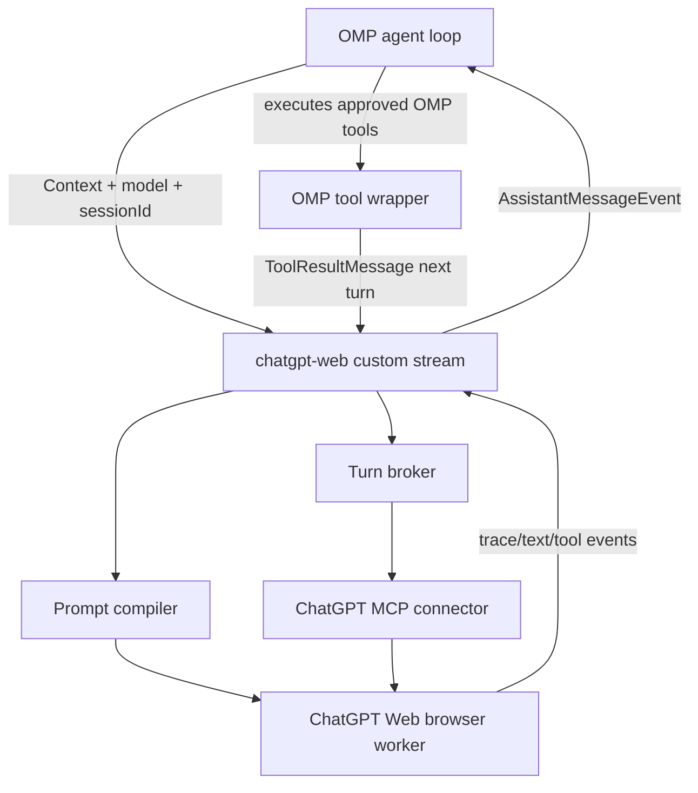

# ChatGPT Web Provider for oh-my-pi — Design

**Status:** Approved local design for implementation and testing in `Nou4r/oh-my-pi`. No upstream PR, issue, Discord post, or push is part of this phase.

## Decision summary

Integrate the browser-backed ChatGPT Web capability as a first-party optional OMP workspace package, exposed through OMP's existing custom provider API. The provider will appear in the native model picker after the package extension is enabled, emit standard OMP assistant/tool events, and preserve OMP's existing tool execution, approval, session, and TUI behavior.

Add one narrow host-side capability to the existing runtime provider configuration: `auth: "none"` is accepted only with an opaque host-issued registration capability bound to the exact `chatgpt-web` API, package-owned extension source, `chatgpt-web://local` base URL, and verified marker/config state. It does not become a generic keyless escape hatch and does not add a `KnownApi`, `ApiOptionsMap` entry, or generic wire protocol. The ChatGPT Web extension uses this capability-gated path; it never registers a fake OAuth credential or exposes a local profile identifier through `AuthStorage`, `apiKey`, `omp token`, or request headers.

Do not import the Codex configuration journal, and do not make `oh-my-pi` depend on the `codex-chatgpt-web` repository or fork at runtime. The fork is a source/reference checkout while the implementation is developed locally.

## Goals

- Make `chatgpt-web/light`, `medium`, `high`, `extra-high`, and account-gated `pro` selectable as OMP models.
- Reuse the proven browser/session behavior from `codex-chatgpt-web`: fresh Temporary Chats, native image attachments, fixed effort mapping, bounded parallel tabs, DOM/completion health checks, cancellation, and fail-closed behavior.
- Translate ChatGPT Web output into OMP `AssistantMessageEvent` events, including reasoning, text, tool calls, usage, terminal status, and errors.
- Let OMP's existing coding-agent tool wrapper execute local tools and feed the resulting `ToolResultMessage` values back to the browser turn through a capability-bound broker.
- Provide a local CLI login/status/doctor flow before adding desktop packaging.
- Preserve all source and third-party attribution required by the two MIT projects and the bridge's existing `LICENSES` files, without retaining stale runtime-version notices.
- Reach a locally tested, upstream-reviewable state before any maintainer contact.

## Non-goals

- No immediate upstream PR or push.
- No direct dependency on `Nou4r/codex-chatgpt-web`.
- No direct reuse of Codex's `~/.codex` configuration, `openai_base_url` journal, Codex model catalog, or Codex request envelope.
- No new general-purpose OMP wire API in `packages/ai/src/types.ts` or `ApiOptionsMap`; the only host change is the provider-registration `auth: "none"`/model-capability metadata needed for this local provider.
- No Electron launcher in the first provider milestone.
- No silent fallback from ChatGPT Web to another model, no retry loop intended to evade account limits, and no behavior that weakens OMP tool approval or sandbox policy.

## Why this boundary

`codex-chatgpt-web` is a complete executable system rather than a normal provider: it owns a Bun Responses daemon, a Playwright browser worker, ChatGPT Temporary Chat lifecycle, optional MCP/tunnel capability routing, Codex-specific request parsing, Codex config mutation, and a cross-platform Electron supervisor. The reusable behavior is concentrated in the ChatGPT browser adapter, prompt/attachment handling, turn-session lifecycle, model effort mapping, and lifecycle/security tests.

OMP already has the required host seam, with two small runtime-provider metadata extensions:

- `ExtensionAPI.registerProvider()` accepts `streamSimple`, custom models, headers, and OAuth login.
- `ModelRegistry.registerProvider()` registers the custom API and manages source cleanup.
- `@oh-my-pi/pi-ai` dispatches non-built-in API identifiers through `registerCustomApi()` before built-in APIs.
- `AssistantMessageEvent` already represents text, thinking, tool-call, completion, abort, and error events.
- The coding-agent loop already executes returned tool calls through `ExtensionToolWrapper` and provides the resulting `ToolResultMessage` entries on the next provider request.
- Runtime provider registration will accept `auth: "none"` only with the source/API/base-URL-bound opaque capability issued by the host after ChatGPT Web marker/config validation, and will propagate `supportsTools` in model metadata without changing `packages/ai/src/types.ts` or `ApiOptionsMap`.
- The structural host contract includes `issueKeylessProviderRegistration({ api: "chatgpt-web", baseUrl: "chatgpt-web://local" })`, returning a non-serializable `KeylessProviderRegistration` or `undefined`. The loaded extension calls it only after validating its owner-controlled marker/config; the host binds issuance to the loaded extension source, and `ModelRegistry` validates the opaque object identity/source/generation before accepting the queued registration. The extension declares this narrow structural method locally and never imports coding-agent types.

A new built-in `KnownApi` would expand exhaustive type and dispatch surfaces for no functional benefit. A separate package keeps Playwright, MCP, browser selectors, and platform lifecycle code out of the core provider matrix while retaining native OMP UX.

## Package ownership

### `packages/chatgpt-web`

Owns the browser-backed runtime and the OMP provider adapter.

- ChatGPT account login verification and durable browser profile state.
- ChatGPT model routes and account-gated Pro availability checks.
- Playwright browser worker, Temporary Chat navigation, effort selection, attachment/send readiness, DOM completion tracking, Markdown conversion, and bounded concurrency.
- OMP context-to-browser prompt compilation.
- OMP assistant-event conversion.
- Per-session turn state and capability-bound broker.
- Full-mode MCP server and tunnel client integration after browser-only mode is stable.
- Local `login`, `status`, `doctor`, `serve`, and `uninstall` commands.
- Package-local tests, security documentation, and third-party notices.

The first-party extension entry point is fixed at `packages/chatgpt-web/src/extension.ts`. The `omp chatgpt-web enable` command resolves that module through the package export and writes its absolute path to the existing `settings.extensions` list using `Settings.set()` and `Settings.flush()`. This keeps provider discovery explicit, makes disabled installs incur no browser startup, and gives source checkouts and published packages the same activation contract.

The package may use `@oh-my-pi/pi-ai` and `@oh-my-pi/pi-catalog` types and event-stream utilities. It defines a small structural extension-registration type instead of importing coding-agent internals, avoiding a workspace dependency cycle. It must not execute OMP tools itself.

### `packages/coding-agent`

Only owns the host-facing enablement surface:

- `src/commands/chatgpt-web.ts` resolves the package extension and implements `enable`, `disable`, `status`, `login`, and `doctor` dispatch.
- `src/cli-commands.ts` adds one lazy top-level `chatgpt-web` entry.
- Settings/help documentation explains the existing `settings.extensions` activation path.

The host must not duplicate browser selectors, prompt parsing, MCP protocol code, or launcher supervision.

### `packages/chatgpt-web-launcher` (later local phase)

Owns the Electron control center and process supervisor. It will consume the runtime package's versioned CLI/control contract and will not be embedded into `packages/coding-agent`.

## Provider contract

The extension registers one custom API identifier, `chatgpt-web`, and a fixed model set derived from the source routes:

| Model ID | Display label | Effort | Local tools |
| --- | --- | --- | --- |
| `chatgpt-web/light` | ChatGPT Web — Instant | `low` | yes only in full mode |
| `chatgpt-web/medium` | ChatGPT Web — Medium | `medium` | yes only in full mode |
| `chatgpt-web/high` | ChatGPT Web — High | `high` | yes only in full mode |
| `chatgpt-web/extra-high` | ChatGPT Web — Extra High | `xhigh` | yes only in full mode |
| `chatgpt-web/pro` | ChatGPT Web — Pro | `max` | no |

The registration uses `api: "chatgpt-web"`, `baseUrl: "chatgpt-web://local"`, and `auth: "none"`. Model metadata uses the OMP field `name` (not `displayName`), a `thinking: { mode: "effort", efforts: [...] }` capability matching the route, a `256_000` context window, `64_000` maximum output tokens, zero API cost, no service tiers, no native OpenAI WebSocket support, and no native server-side compaction. Non-Pro models advertise `supportsTools: true` only in full mode; browser-only and Pro models advertise `supportsTools: false`.

OMP model definitions use bare IDs `light`, `medium`, `high`, `extra-high`, and `pro`; the package route table may use full slugs, but the provider registration must not duplicate the `chatgpt-web/` prefix. Tests must assert both `model.provider === "chatgpt-web"` and the rendered selectors `chatgpt-web/light` through `chatgpt-web/pro`.

The extension's `streamSimple(model, context, options)` is the only provider entry point. It must:

1. Require a stable `options.sessionId` for every browser turn and full-mode continuation.
2. Require a valid owner-controlled verification marker and resolve the browser profile locally; accept only OMP's normal keyless `N/A` sentinel as an ignored `options.apiKey` placeholder, reject any other non-empty credential, and never expose profile paths or capability identifiers to ChatGPT.
3. Reuse a provider-session object from `options.providerSessionState` when present, with one profile owner and a process-wide five-turn lease cap.
4. Start or resume the turn session for the selected model route.
5. Convert browser trace/text/tool events into OMP `AssistantMessageEvent` values.
6. Return `toolUse` after emitting tool calls so the production coding-agent wrapper executes them.
7. On the next call, match `ToolResultMessage.toolCallId` values to pending broker invocations and resume the same browser turn.
8. Fail explicitly on missing session identity, stale capability handles, unknown tool names, unsupported Pro tool calls, malformed browser output, selector drift, closed tabs, profile-owner conflicts, or cross-session results.

Login is a package-local command/host operation, not an OMP OAuth registration. The verified marker contains only versioned authentication and Pro-capability state plus non-secret profile-generation, executable-digest/version, immutable-identity, and ownership-fence metadata required to reject stale or swapped browser state; it never contains a profile path, account/profile identifier, cookie, header, token, or credential. No profile identifier is stored in `AuthStorage`, passed as `SimpleStreamOptions.apiKey`, printed by `omp token`, or sent as an HTTP header. Browser state is stored below `${agentDir}/chatgpt-web/browser-profile`, while configuration, ownership, and control state are stored below `${agentDir}/chatgpt-web` with link-aware ownership checks and platform-appropriate restrictive ACLs. `${agentDir}` is OMP's existing `PI_CODING_AGENT_DIR`/`~/.omp/agent` root.

## Data flow

Browser-only mode omits the broker and MCP connector. Full mode creates the broker endpoint and provider runtime epoch before starting the tunnel. The tunnel owns the versioned stdio MCP child command and gives it an opaque native launch environment built from already-open bootstrap/runtime-key handles; it never passes a caller-reopenable bootstrap or key pathname. The child proves the one-time file authenticator over the broker connection; if the child races ahead of tunnel authorization, the broker holds that proof in a bounded pending state. After `authorizeTunnel()` registers the native opaque identity from `NativeOwnedProcess.identity`/native verification, the broker accepts only a peer PID obtained through native OS APIs (Linux `SO_PEERCRED`, macOS `LOCAL_PEERPID`/equivalent, Windows `GetNamedPipeClientProcessId`) that is a live descendant with the expected identity, then atomically consumes/removes the bootstrap. Unsupported or unverifiable peer identity fails closed; plain PID/start/executable status objects cannot authorize a tunnel. Same-user file confidentiality is out of scope, but same-user competing clients cannot impersonate the authorized tunnel ancestry. Tunnel health is insufficient until that child reaches the broker and proves the same runtime epoch. The broker never grants a tool based solely on a browser-provided name: every invocation must match the current OMP tool declaration, post-hook arguments, active turn capability, and expiry.

## Source porting map

### Reuse and adapt

- `codex-chatgpt-web/src/adapters/chatgpt-web/browser-worker.ts` → package browser worker; replace `CodexProviderConfig` with package-owned runtime config and preserve bounded tab/completion invariants.
- `codex-chatgpt-web/src/chatgpt-session.ts` and `codex-chatgpt-web/src/browser-login.ts` → package selectors, Temporary Chat checks, and login support.
- `codex-chatgpt-web/src/adapters/chatgpt-web/markdown.ts` and `process-line-writer.ts` → package browser output and helper-process safety.
- `codex-chatgpt-web/src/adapters/chatgpt-web/prompt.ts` → OMP context prompt compiler; remove Codex-only envelope fields and preserve attachment/retired-handle rules.
- `codex-chatgpt-web/src/adapters/chatgpt-web/turn-execution.ts` → OMP provider-session/trace feeds.
- `codex-chatgpt-web/src/adapters/chatgpt-web/concurrency.ts`, `usage.ts`, `model.ts` → package model/concurrency/usage modules, with OMP event and usage types.
- `codex-chatgpt-web/src/adapters/chatgpt-web/turn-broker.ts`, `mcp-server.ts`, `mcp-main.ts` → full-mode broker/MCP, after replacing Codex request identity with OMP session/turn identity and production approval-wrapper integration.
- `codex-chatgpt-web/src/tunnel.ts`, `tunnel-service.ts` → later full-mode tunnel lifecycle; preserve the tunnel-owned stdio child model, with checksum and secret-storage requirements.

### Do not port directly

- `src/types.ts` Codex wire types.
- `src/responses/schema.ts`, `parser.ts`, `state.ts`, and `compaction.ts` as Codex request parsing; only their protocol-independent lifecycle ideas may be reimplemented against OMP `Context`/`Message`.
- `src/server.ts`, `bridge.ts`, and `native-passthrough.ts` for the initial native provider path; OMP consumes event streams directly rather than routing through a Codex loopback Responses daemon.
- `src/codex-integration.ts`, `setup.ts`, and `service.ts`; they mutate or supervise Codex configuration and are not valid OMP integration points.
- Electron launcher files until the provider has passed local live smoke tests.

## Security invariants

- Browser state, profile identifiers, tunnel credentials, and control tokens stay under an owner-controlled OMP application directory; roots and children reject symlink/junction/reparse traversal, and Windows ACLs are verified rather than treating POSIX mode bits as sufficient. The full-mode bootstrap file contains a one-time authenticator but is not confidential against same-user readers; broker admission is bound to peer credentials and verified tunnel-process ancestry, with consumption only after that binding succeeds.
- Owner-controlled native local listener/pipe control channels authenticate the owner peer/connection, expected lifecycle epoch, monotonic request sequence, and a random control token as a supplemental bearer secret; they are not loopback TCP bearer endpoints. A read-only sanitized health view may be exposed in-process, but drain/resume/cancel/shutdown require native peer proof. The launcher never exposes a reusable unauthenticated raw CDP endpoint; browser automation crosses one authenticated per-lease host RPC boundary.
- Browser-only and full-mode login/lease browser starts use the digest/version-bound native verified Chrome executable, an owner-controlled profile directory handle, a private inherited transport, and native owned descendant teardown; Playwright receives only the package-owned transport adapter and never a path, endpoint URL, or ambient environment. Executable/profile replacement, orphan survival, PID reuse, and stale-owner races fail closed.
- Browser turns are capped at five active documents per profile owner; a sixth request fails explicitly. A second local process cannot silently create a second owner.
- Every full-mode tool call is bound to one OMP session, turn, declared tool set, post-approval arguments, and expiry.
- OMP's production approval wrapper, sandbox, and write-gating remain authoritative; ChatGPT Web cannot bypass them.
- Normal logs use an allowlisted structured schema and never include DOM text, prompts, headers, URLs with queries, child stdout/stderr, cookies, profile IDs, or tokens. High-entropy canaries are checked across disk, rotated logs, UI payloads, stdout, and stderr.
- ChatGPT Web model/selector/completion drift fails closed with an actionable error.
- Pro never receives local tool capabilities.
- No fallback or retry changes the selected ChatGPT mode to evade usage controls.

## Licensing and provenance

Both repositories are MIT. The port must retain the bridge's attribution and `LICENSES/NOTICE.md`/`LICENSES/OpenCodex-MIT.txt` for copied substantial code, update every copied-file notice, and generate a complete third-party notice file from the OMP lockfile and package metadata. Do not retain the source `Bun-1.3.11.md` blindly: replace it with the exact Bun/runtime provenance only if the launcher redistributes that runtime, otherwise omit it.

## Validation gates

No upstream action is allowed until all local gates pass:

1. Static checks and focused unit tests for the new package, keyless host registration, model IDs/capabilities, and settings persistence.
2. Browser fixture tests for login, prompt/attachment compilation, model effort selection, selector/completion tracking, profile ownership, link/ACL rejection, tab cap, cancellation cleanup, and malformed output.
3. Broker + real stdio MCP-child integration using a fake tunnel, with the production `AgentSession`/`ExtensionToolWrapper` approval path: read, approved write, denied write with zero mutation, tool error, stale/cross-session replay rejection, Pro capability omission, and exact-once continuation.
4. Live browser-only smoke through the real OMP picker: login, every non-Pro effort, text, reasoning, image, cancellation, restart, and five/six-turn behavior, producing redacted versioned JSON evidence.
5. Live full-mode smoke: broker-first startup, tunnel-spawned MCP child, connector identity match, read tool, approved/denied write, tool error, cancellation while a tool is pending, and continuation after tool results, with the same evidence schema.
6. Launcher integration gates: no unauthenticated raw CDP attachment, authenticated per-lease host RPC, descriptor/owner/epoch validation, isolated cancellation, drain/shutdown postconditions, installer, IPC allow-list, and log-canary absence.
7. Local package/build smoke on supported OS runners; live browser and tunnel checks remain an explicit protected manual workflow, never normal PR CI.
8. Rebase against `upstream/main`, repeat all gates, inspect the diff for generated noise, and prepare a draft PR body without pushing or submitting it.

Every manual record contains only schema version, commit, OS/arch, runtime/browser/tunnel versions, scenario ID, pass/fail, and invariant observations under an ignored local evidence directory. The implementation is rejected as not ready if any path silently falls back to another model, bypasses OMP approvals, leaks browser credentials, exposes raw CDP, or loses tool/session identity across a continuation.
