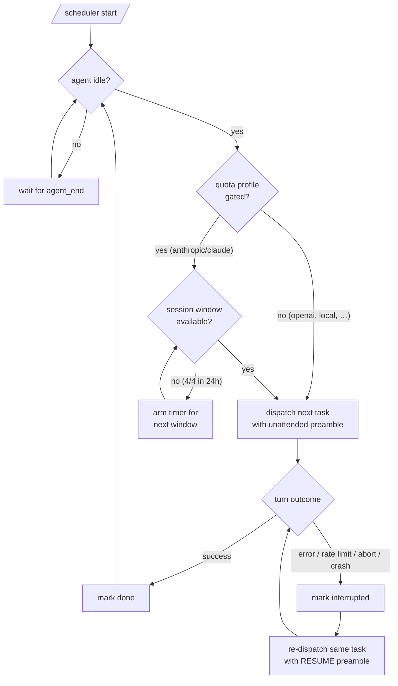

# scheduler — session-quota-aware prompt queue for oh-my-pi

Queue up prompts before bed. `scheduler` drains them unattended: it dispatches
the next task whenever the agent goes idle, tracks Claude's **5-hour session
windows** (max **4 per rolling 24 h**) when the active model runs on Claude
subscription auth, dispatches ungated for every other provider, waits for the
next window when a gated quota is exhausted — and when a task dies mid-flight
(rate limit, error, abort, crash) it **resumes that task instead of skipping
it**.

It is a single-file [oh-my-pi](https://github.com/oh-my-pi) (omp) extension:
no daemon, no external process, no RPC client. It runs inside your omp
session and adds one slash command: `/scheduler`.

## Why

Claude subscriptions meter usage in 5-hour session windows, with a cap on how
many windows you can open per rolling 24 hours. If you only use omp at your
desk, most of those windows expire unused. `scheduler` lets you bank real
work for the hours you are asleep:

1. Queue tasks with `/scheduler add ...`.
2. `/scheduler start` and go to bed.
3. The extension sends the next prompt each time the agent goes idle,
   opens session windows only when the quota allows it, sleeps until the next
   window when it doesn't, and retries interrupted tasks with a
   "continue where you left off" preamble.
4. Wake up, read `/scheduler log`.

## Install

> **Requires**: [oh-my-pi](https://github.com/oh-my-pi) with the extension
> runtime (`~/.omp/agent/extensions/` support) and Bun (omp ships with it).

**Option A — copy/symlink into the user extensions directory** (loaded on
every omp launch; see omp's `extension-loading` docs — a one-level
subdirectory with a `package.json` manifest or `index.ts` is discovered
automatically):

```bash
# macOS/Linux
git clone https://github.com/YOU/scheduler ~/.omp/agent/extensions/scheduler

# Windows (PowerShell) — copy…
git clone https://github.com/YOU/scheduler "$env:USERPROFILE\.omp\agent\extensions\scheduler"
# …or symlink a working checkout (needs Developer Mode or admin):
New-Item -ItemType SymbolicLink `
  -Path "$env:USERPROFILE\.omp\agent\extensions\scheduler" `
  -Target "D:\Projects\scheduler"
```

**Option B — reference it from settings** (`~/.omp/agent/config.yml`):

```yaml
extensions:
  - D:/Projects/scheduler
```

**Option C — load once via CLI flag:**

```bash
omp --extension D:/Projects/scheduler
```

Restart omp. `/scheduler` (with no arguments) prints usage.

## ⚠️ Prerequisite: approval mode must be `yolo`

Overnight runs are unattended. If omp asks "Allow tool: bash?" at 3 AM,
nobody answers and the whole night is wasted. Before starting the scheduler,
make sure every tool call is auto-approved:

```bash
omp --yolo                                  # per launch, or:
omp config set tools.approvalMode yolo      # persistent
```

`/scheduler start` checks the persisted `tools.approvalMode` in your omp
config files and shows a confirmation warning when it is set to something
other than `yolo`. It **cannot** see runtime flags (they are in-memory only),
so if you launched with `--yolo` you can safely confirm through the warning.

Also disable OS sleep for the machine — the queue runs inside the omp
process; a sleeping laptop dispatches nothing.

## Usage

```text
/scheduler add <prompt>        queue a task
/scheduler add-file <path>     queue a task whose prompt is the file's content
/scheduler list                show queue, current task, session-window state
/scheduler status              alias of list
/scheduler start               begin draining the queue when the agent is idle
/scheduler pause               finish the current task, then hold
/scheduler stop                abort the current task (kept as resumable) and hold
/scheduler remove <id>         remove one queued task
/scheduler clear               remove all pending tasks
/scheduler log [n]             show the last n JSONL log entries (default 10)
/scheduler config              show the config file path and current values
```

Examples:

```text
/scheduler add Refactor src/parser.ts to a recursive-descent parser; keep tests green
/scheduler add-file prompts/nightly-refactor.md
/scheduler start
/scheduler status
```

`status` output looks like:

```text
scheduler: running
model: anthropic/claude-fable-5 — quota: 5h×4 (anthropic)
windows: 2/4 used in last 24h; active window ends in 3h12m
current: t3 (attempt 2) — Migrate the database layer to Drizzle…
queue:
  t4  queued      Write integration tests for the auth flow
  t5  interrupted Port CI to GitHub Actions (attempt 1, rate limited)
finished: 3 done, 0 failed (/scheduler log for details)
context: 45% of 200k tokens
```

## How it works



- **Dispatch loop** — the extension listens to omp's `agent_start` /
  `agent_end` session events. While running, each `agent_end` (plus an idle
  check) triggers the next dispatch via omp's user-prompt flow
  (`sendUserMessage`), exactly as if you had typed the prompt.
- **Quota tracking** — applies only when the active model matches a *gated*
  quota profile (by default: anthropic/claude — see
  [Model awareness](#model-awareness)). Every agent turn that begins outside
  an active window records a new window start in `state.json`, tagged with
  the profile it was tracked under (manual prompts count too). A dispatch is
  only allowed when a window is active or fewer than the profile's
  `maxSessionsPer24h` windows started in the rolling 24 h. When blocked, a
  timer fires at the moment the oldest window ages out (+ configurable
  slack) and dispatching resumes automatically. Ungated models record no
  windows and dispatch whenever the agent is idle.
- **Resume, not skip** — a task whose turn ends in an error/abort (or whose
  provider retries are exhausted — `auto_retry_end`) is marked
  `interrupted`. It keeps its place at the head of the queue and is re-sent
  with a resume preamble ("Continue exactly where you left off; do not
  repeat completed work"). After `maxAttempts` total attempts it is marked
  `failed` and the queue moves on. Tasks left `running` by a crashed or
  closed omp process are recovered as `interrupted` on the next launch.
- **Prompt wrapper** — every dispatched prompt is prefixed with a
  token-efficiency/autonomy preamble (no summaries, no progress narration,
  never ask questions — decide autonomously and note assumptions in a final
  line). Both preambles live in `config.json`; edit them to taste.

## Model awareness

Only **Anthropic Claude subscription auth** meters usage in 5-hour session
windows (max 4 per rolling 24 h). API-key billing and every other provider
(OpenAI, Google, local models, …) have no such windows — gating them would
just waste idle hours. The scheduler therefore resolves the active
provider/model at dispatch time (and at every turn start) and matches it
against the ordered `quotaProfiles` list in `config.json`; the first match
wins:

```json
"quotaProfiles": [
	{ "match": "anthropic|claude", "sessionHours": 5, "maxSessionsPer24h": 4 },
	{ "match": ".*", "sessionHours": null, "maxSessionsPer24h": null }
]
```

- `match` is a case-insensitive regex tested against the provider id, the
  model id, and `provider/modelId` of the active model.
- `sessionHours`/`maxSessionsPer24h` set the window policy; `null` (either
  field) means **unlimited**: no windows are recorded and dispatch is never
  quota-blocked for that model.
- A model that matches no profile — or a provider/model the extension cannot
  detect at all — runs **unlimited**, and a `notice` line is written to the
  task log so the decision is visible.
- Each window record in `state.json` stores the profile it was tracked
  under, so switching models mid-day (e.g. `/model` from Claude to GPT and
  back) never corrupts the Claude window counts.
- `/scheduler status` shows the detected model and the applied profile:
  `model: anthropic/claude-fable-5 — quota: 5h×4 (anthropic)` vs
  `model: openai/gpt-5 — quota: none (openai)`.

> **Note:** the extension cannot see *how* you authenticate. If you use
> Anthropic models via API-key billing (no session windows), replace the
> first profile's limits with `null`/`null` to run ungated.

Legacy configs (`windowHours`/`maxWindowsPer24h`) are migrated automatically:
their values become the gated anthropic profile's limits.

## Configuration

`/scheduler config` prints the file path. Default location:
`~/.omp/agent/scheduler/config.json` (respects `PI_CODING_AGENT_DIR`).
The file is created with defaults on first load and re-read on every
`/scheduler start` and session start.

| Key | Default | Meaning |
|---|---|---|
| `quotaProfiles` | anthropic/claude → 5h×4, `.*` → unlimited | Ordered provider/model → window-policy map; see [Model awareness](#model-awareness). |
| `maxAttempts` | `3` | Total attempts (first + resumes) before a task is marked `failed`. |
| `dispatchDelayMs` | `4000` | Idle settle delay before dispatching the next task. |
| `windowSlackMs` | `60000` | Extra wait added to the next-window resume timer. |
| `promptPreamble` | see file | Prepended to **every** dispatched prompt. |
| `resumePreamble` | see file | Additionally prepended when resuming an interrupted task. |

## State files

Everything lives under `~/.omp/agent/scheduler/`
(or `$PI_CODING_AGENT_DIR/scheduler/`):

| File | Contents |
|---|---|
| `state.json` | Queue, task statuses/attempts, run mode, observed session-window start times (each tagged with its quota profile), in-flight task id. Written atomically on every change; survives restarts. |
| `config.json` | User-editable configuration (table above). |
| `task-log.jsonl` | Append-only log: one JSON object per event — `start`, `pause`, `stop`, `dispatch`, `end` (with status, error, duration), `blocked` (with resume time), `resume_timer`, `window_start`, `recovered`, `retry_failed`, `notice` (e.g. undetectable provider → ungated). `/scheduler log [n]` pretty-prints the tail. |

Deleting `state.json` resets the queue and window history; deleting
`config.json` restores defaults on next load.

## Limitations

Honest list — these follow from what omp's documented extension API can and
cannot express:

1. **Window accounting is a local approximation.** A window is recorded when
   *this* omp process observes an agent turn start outside an active window
   (gated profiles only; ungated models record nothing). Usage from other
   machines, the Claude apps, or other omp instances is invisible;
   Anthropic's server is the source of truth. If you burned windows
   elsewhere, the scheduler may dispatch into a rate limit — that turn is
   then marked `interrupted` and retried in the next window, so work is
   still not lost. The auth mode is equally invisible: profiles match on
   provider/model id, not on subscription-vs-API-key, so API-key Anthropic
   users should edit `quotaProfiles` (see
   [Model awareness](#model-awareness)).
2. **Turn-failure detection is best-effort.** omp documents `agent_end` as a
   notification-only lifecycle event and does not specify a typed error
   payload for extensions. The extension inspects the final assistant
   message defensively (`stopReason` of `error`/`aborted`, `errorMessage`)
   and listens to `auto_retry_end` for exhausted provider retries. An
   unrecognizable payload is treated as success. Crash/shutdown recovery is
   independent of this and always resumes tasks that never finished.
3. **The `--yolo` runtime flag cannot be verified.** omp keeps runtime flag
   overrides in memory only, so the pre-start check reads the persisted
   config files. A non-`yolo` result is a *warning with a confirm dialog*,
   not a hard block.
4. **No OS-level scheduling.** This is an in-process extension, not a
   daemon: the omp session must stay open and the machine awake. Disable
   sleep/hibernation for overnight runs.
5. **Shared session context.** Queued tasks run sequentially in the current
   omp session, so later tasks see earlier tasks' conversation (usually a
   feature; occasionally not). Long nights may trigger omp's automatic
   compaction — that is normal and handled by omp itself.
6. **Manual use while running.** The dispatcher fires after *any* agent turn
   ends. If you interact manually while the scheduler is running, your turn
   ending can trigger the next queued task. `/scheduler pause` first.

## Development

```bash
bun run check     # syntax/transpile check (bun build --no-bundle)
bun run smoke     # behavioral smoke test against a mocked ExtensionAPI
```

The smoke test (`test/smoke.ts`) uses a throwaway `PI_CODING_AGENT_DIR`, so
it never touches your real queue or config.

## Contributing

Issues and PRs welcome. Keep it a single-file extension (`index.ts`), cite
the omp doc section for every runtime API you use (see the existing code
comments), run `bun run check` and `bun run smoke` before submitting, and
update the config/state tables in this README when you change the schema.
Interested in getting this into omp itself? See
[CONTRIBUTING-UPSTREAM.md](./CONTRIBUTING-UPSTREAM.md).

## License

[MIT](./LICENSE)
